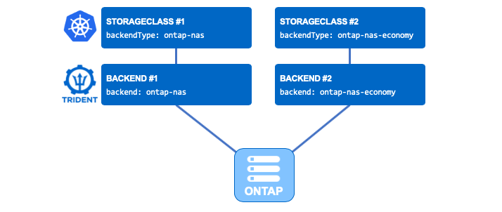

# Create your first NFS backends for Trident & Storage Classes for Kubernetes

**Objective:**  

Trident needs to know where to create volumes.  This information sits in objects called backends. A backend contains:  

- The driver type
  - There currently are 12 different drivers available within Trident for the various NetApp portfolio of on-prem and Cloud based storage
- How to connect to the driver
  - IP, login, password, etc...
- Some default parameters

For additional information, please refer to the official NetApp Trident documentation on Read the Docs:

- <https://netapp-trident.readthedocs.io/en/latest/kubernetes/tridentctl-install.html#create-and-verify-your-first-backend>
- <https://netapp-trident.readthedocs.io/en/latest/kubernetes/operations/tasks/backends/index.html>

Once you have configured backend, the end user will create Persistent Volume Claims (PVCs) against Storage Classes.  
A storage class contains the definition of what an app can expect in terms of storage, defined by some properties (access type, media, driver ...)

For additional information, please refer to:

- <https://netapp-trident.readthedocs.io/en/latest/kubernetes/concepts/objects.html#kubernetes-storageclass-objects>

Also, installing & configuring Trident + creating Kubernetes Storage Classes is what is expected to be done by the Admin.



**Note:** All below commands are to be run against the dev cluster. Unless specified differently, please connect using PuTTY to the dev k8s cluster's master node (**`rhel5`**) to proceed with the task.  

## A. Create your first NFS backends

You will find in this directory a few backends files.  
You can decide to use all of them, only a subset of them or modify them as you wish

First, make sure you are in the correct directory on rhel5 for this task:

```bash
[root@rhel5 config_grafana]# cd ~/netapp-bootcamp/trident_with_k8s/tasks/config_file
[root@rhel5 config_file]#
```

Here are the 2 backends & their corresponding driver:

- dev-backend-ontap-nas.json        ONTAP-NAS
- dev-backend-ontap-nas-eco.json    ONTAP-NAS-ECONOMY

```bash
[root@rhel5 config_file]# tridentctl -n trident create backend -f dev-backend-ontap-nas.json
+-----------------+----------------+--------------------------------------+--------+---------+
|      NAME       | STORAGE DRIVER |                 UUID                 | STATE  | VOLUMES |
+-----------------+----------------+--------------------------------------+--------+---------+
| ontap-file-rwx  | ontap-nas      | 282b09e5-0ff2-4471-97c8-9fd5224945a1 | online |       0 |
+-----------------+----------------+--------------------------------------+--------+---------+

[root@rhel5 config_file]# tridentctl -n trident create backend -f dev-backend-ontap-nas-eco.json
+---------------------+-------------------+--------------------------------------+--------+---------+
|        NAME         |  STORAGE DRIVER   |                 UUID                 | STATE  | VOLUMES |
+---------------------+-------------------+--------------------------------------+--------+---------+
| ontap-file-rwx-eco  | ontap-nas-economy | b21fb2a7-975a-4050-a187-bb4f883d0e97 | online |       0 |
+---------------------+-------------------+--------------------------------------+--------+---------+

[root@rhel5 config_file]# kubectl get -n trident tridentbackends
NAME        BACKEND               BACKEND UUID
tbe-sh9gm   ontap-file-rwx        282b09e5-0ff2-4471-97c8-9fd5224945a1
tbe-zkwtj   ontap-file-rwx-eco    b21fb2a7-975a-4050-a187-bb4f883d0e97
```

Feel free to also see that your Grafana dashboard is now reporting that you have 2 Trident backends configured.

## B. Create storage classes pointing to each backend

You will also find in this directory a few storage class files.
You can decide to use all of them, only a subset of them or modify them as you wish

```bash
[root@rhel5 config_file]# kubectl create -f sc-csi-ontap-nas.yaml
storageclass.storage.k8s.io/sc-file-rwx created

[root@rhel5 config_file]# kubectl create -f sc-csi-ontap-nas-eco.yaml
storageclass.storage.k8s.io/sc-file-rwx-eco created

[root@rhel5 config_file]# kubectl get sc
NAME                        PROVISIONER             AGE
sc-file-rwx           csi.trident.netapp.io   2d18h
sc-file-rwx-eco       csi.trident.netapp.io   2d18h
```

At this point, end-users can now create PVCs against one of theses storage classes.  

## C. What's next

Now, you have some NAS backends & some storage classes configured. You can proceed to the creation of an NFS based stateful application:  

- [Deploy your first app with File storage](../file_app)  

or stay on the dev cluster to...

- [Configure your first iSCSI backends & storage classes](../config_block)  

---
**Page navigation**  
[Top of Page](#top) | [Home](/README.md) | [Full Dev Task List](/README.md#dev-k8s-cluster-tasks)
