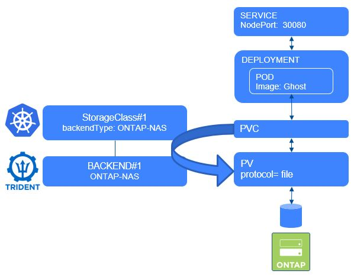

# Creating Your First App with File (RWX) Storage

**GOAL:**  
Now that you have a lab with Trident configured and storage classes, you can request a Persistent Volume Claim (PVC) for your application.  

For this task you will be deploying Ghost (a light weight web portal) utlilising RWX (Read Write Many) file-based persistent storage over NFS.  You will find a few .yaml files in the Ghost directory, so ensure that your putty terminal on the lab is set to the correct directory for this task:

```bash
[root@rhel3 ~]# cd /root/NetApp-LoD/trident_with_k8s/tasks/file_app/ghost
```
The .yaml files provided are for:

- A PVC to manage the persistent storage of this app
- A DEPLOYMENT that will define how to manage the app
- A SERVICE to expose the app

Feel free to familiarise yourself with the contents of these .yaml files if you wish.  You will see in the ```1_pvc.yaml``` file that it specifies ReadWriteMany as the access mode, which will result in k8s and Trident providing an NFS based backend for the request.  A diagram is provided below to illustrate how the PVC, deployment, service and surrounding infrastructure all hang together:



## A. Create the app

 
From this point on, it is assumed that the required backend & storage class have [already been created](../config_file) either by you or your bootcamp fascilitator.

We will create this app in its own namespace (which also makes clean-up easier). 
```bash
[root@rhel3 ~]# kubectl create namespace ghost
namespace/ghost created
```
Next, we apply the .yaml configuration within the new namespace:
```bash
[root@rhel3 ~]# kubectl create -n ghost -f ../ghost/
persistentvolumeclaim/blog-content created
deployment.apps/blog created
service/blog created
```
Display all resources for the ghost namespace (your specific pod name of blog-XXXXXXXX-XXXX will be unique to your deployment and will need to be used again layter in this task):
```bash
[root@rhel3 ~]# kubectl get all -n ghost
NAME                       READY   STATUS              RESTARTS   AGE
pod/blog-57d7d4886-5bsml   1/1     Running             0          50s

NAME           TYPE       CLUSTER-IP     EXTERNAL-IP   PORT(S)        AGE
service/blog   NodePort   10.97.56.215   <none>        80:30080/TCP   50s

NAME                   READY   UP-TO-DATE   AVAILABLE   AGE
deployment.apps/blog   1/1     1            1           50s

NAME                             DESIRED   CURRENT   READY   AGE
replicaset.apps/blog-57d7d4886   1         1         1       50s
```
List the PVC and PV associated with the ghost namespace:
```bash
[root@rhel3 ~]# kubectl get pvc,pv -n ghost
NAME                                 STATUS   VOLUME                                     CAPACITY   ACCESS MODES   STORAGECLASS        AGE
persistentvolumeclaim/blog-content   Bound    pvc-ce8d812b-d976-43f9-8320-48a49792c972   5Gi        RWX            sc-file-rwx         4m3s

NAME                                                        CAPACITY   ACCESS MODES   RECLAIM POLICY   STATUS   CLAIM                       STORAGECLASS        REASON   AGE
persistentvolume/pvc-ce8d812b-d976-43f9-8320-48a49792c972   5Gi        RWX            Delete           Bound    ghost/blog-content          sc-file-rwx                  4m2s
...
```

## B. Access the app

It takes about 40 seconds for the POD to be in a *running* state
The Ghost service is configured with a NodePort type, which means you can access it from every node of the cluster on port 30080.
Give it a try !
=> <http://192.168.0.63:30080>

## C. Explore the app container

Let's see if the */var/lib/ghost/content* folder is indeed mounted to the NFS PVC that was created.  
**You need to customize the following commands with the POD name you have in your environment.**

```bash
[root@rhel3 ~]# kubectl exec -n ghost blog-57d7d4886-5bsml -- df /var/lib/ghost/content
Filesystem           1K-blocks      Used Available Use% Mounted on
192.168.0.135:/ansible_pvc_ce8d812b_d976_43f9_8320_48a49792c972
                       5242880       704   5242176   0% /var/lib/ghost/content
```
List out the files found in the ghost/content directory within the PV (don't forget to use your specific blog-XXXXXXXX-XXXX details found in the earlier CLI output):
```bash
[root@rhel3 ~]# kubectl exec -n ghost blog-57d7d4886-5bsml -- ls /var/lib/ghost/content
apps
data
images
logs
lost+found
settings
themes
```

It is recommended that you also monitor your environment from the pre-created dashboard in Grafana: (<http://192.168.0.141>).  If you carried out the tasks in the [verifying your environment](../verify_lab) task, then you should already have your Grafana username and password which is ```admin:admin``` by default and you will be promted for a new password on 1st login.

## D. Cleanup (optional)

:boom: **The PVC will be reused in the '[Importing a PV](../pv_import)' task. Only clean-up if you dont plan to do the 'Importing a PV' task.** :boom:  

If you still want to go ahead and clean-up, instead of deleting each object one by one, you can directly delete the namespace which will then remove all of its associated objects.  


```
[root@rhel3 ~]# kubectl delete ns ghost
namespace "ghost" deleted
```

## E. What's next

Hopefully you are getting more familiar with Trident and persistent storage in k8s now. You can move on to:  

- [Next task](../block_app): Deploy your first app using Block storage  
or jump ahead to...
- [Task 8](../pv_import): Use the 'import' feature of Trident  
- [Task 9](../quotas): Consumption control  
- [Task 10](../resize_file): Resize an NFS PVC

---
**Page navigation**  
[Top of Page](#top) | [Home](/README.md) | [Full Task List](/README.md#prod-k8s-cluster-tasks)
