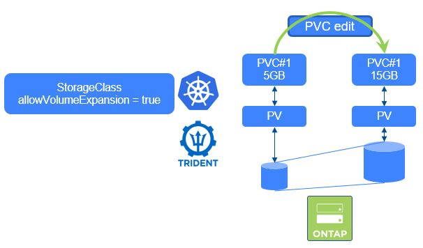

# iSCSI Volume Resizing

**GOAL:**  
Trident supports the resizing of File (NFS) & Block (iSCSI) PVCs, depending on the Kubernetes version.  
NFS Resizing was introduced in k8s 1.11, while iSCSI resizing was introduced in k8s 1.16.  
Resizing a PVC is made available through the option *allowVolumeExpansion* set in the StorageClass.



## A. Create a new storage class with the option allowVolumeExpansion

Ensure you are in the correct working directory by issuing the following command on your rhel3 putty terminal in the lab:

```bash
[root@rhel3 ~]# cd /root/NetApp-LoD/trident_with_k8s/tasks/resize_block/
```

First, you need to create a Storage Class that has volume resizing enabled:

```bash
[root@rhel3 ~]# kubectl create -f sc-csi-ontap-san-resize.yaml
storageclass.storage.k8s.io/sc-san-resize created

[root@rhel3 ~]# tridentctl -n trident get storageclasses
+------------------+
|       NAME       |
+------------------+
| sc-block-rwo     |
| sc-block-rwo-eco |
| sc-san-resize    |
| sc-file-rwx      |
| sc-file-rwx-eco  |
+------------------+
```

## B. Setup the environment

Now let's create a PVC & a Centos POD using this PVC, in their own namespace.

```bash
[root@rhel3 ~]# kubectl create namespace resize
namespace/resize created
[root@rhel3 ~]# kubectl create -n resize -f pvc.yaml
persistentvolumeclaim/pvc-to-resize created

[root@rhel3 ~]# kubectl -n resize get pvc,pv
NAME                                  STATUS   VOLUME                                     CAPACITY   ACCESS MODES   STORAGECLASS    AGE
persistentvolumeclaim/pvc-to-resize   Bound    pvc-0862979c-92ca-49ed-9b1c-15edb8f36cb8   5Gi        RWO            sc-san-resize   11s

NAME                                                        CAPACITY   ACCESS MODES   RECLAIM POLICY   STATUS   CLAIM                  STORAGECLASS    REASON   AGE
persistentvolume/pvc-0862979c-92ca-49ed-9b1c-15edb8f36cb8   5Gi        RWO            Delete           Bound    resize/pvc-to-resize   sc-san-resize            10s

[root@rhel3 ~]# kubectl create -n resize -f pod-centos-san.yaml
pod/centos created

[root@rhel3 ~]# watch -n1 kubectl -n resize get pod

NAME     READY   STATUS    RESTARTS   AGE
centos   1/1     Running   0          81s
```

You can now check that the 5G volume is indeed mounted into the POD.

```bash
[root@rhel3 ~]# kubectl -n resize exec centos -- df -h /data
Filesystem      Size  Used Avail Use% Mounted on
/dev/sdc        4.8G   20M  4.6G   1% /data
```

## C. Resize the PVC & check the result

Resizing a PVC can be done in different ways. Here you will edit the definition of the PVC & manually modify it.  
Look for the `storage` parameter in the spec part of the definition & change the value (here for the example, we will use 15Gi)

```bash
[root@rhel3 ~]# kubectl -n resize edit pvc pvc-to-resize
persistentvolumeclaim/pvc-to-resize edited

spec:
  accessModes:
  - ReadWriteOnce
  resources:
    requests:
      storage: 15Gi
  storageClassName: sc-san-resize
  volumeMode: Filesystem
  volumeName: pvc-0862979c-92ca-49ed-9b1c-15edb8f36cb8
```

Let's see the result (it takes about 1 minute to take effect).

```bash
[root@rhel3 ~]# kubectl -n resize get pvc,pv
NAME                                  STATUS   VOLUME                                     CAPACITY   ACCESS MODES   STORAGECLASS    AGE
persistentvolumeclaim/pvc-to-resize   Bound    pvc-0862979c-92ca-49ed-9b1c-15edb8f36cb8   15Gi       RWO            sc-san-resize   4m3s

NAME                                                        CAPACITY   ACCESS MODES   RECLAIM POLICY   STATUS   CLAIM                   STORAGECLASS    REASON   AGE
persistentvolume/pvc-0862979c-92ca-49ed-9b1c-15edb8f36cb8   15Gi       RWO            Delete           Bound    resize/pvc-to-resize   sc-san-resize            4m2s


[root@rhel3 ~]# kubectl -n resize exec centos -- df -h /data
Filesystem      Size  Used Avail Use% Mounted on
/dev/sdd         15G   25M   14G   1% /data
```

As you can see, the resizing was done totally dynamically without any interruption.

The POD rescanned its devices to discover the new size of the volume.  

Feel free to go back to Grafana in your web browser and see what has happened: (<http://192.168.0.141>).

This could also have been achieved by using the `kubectl patch` command. Try the following one:

```bash
[root@rhel3 ~]# kubectl patch -n resize pvc pvc-to-resize -p '{"spec":{"resources":{"requests":{"storage":"20Gi"}}}}'
```

## D. Cleanup the environment

```bash
[root@rhel3 ~]# kubectl delete namespace resize
namespace "resize" deleted

[root@rhel3 ~]# kubectl delete sc sc-san-resize
storageclass.storage.k8s.io "sc-san-resize" deleted
```

## E. What's next

You can now move on to the next task:  

- [On-Demand Snapshots & Cloning PVCs from Snapshots](../snapshots_clones)  

or jump ahead to...

- [Dynamic export policy management](../dynamic_exports)  

---
**Page navigation**  
[Top of Page](#top) | [Home](/README.md) | [Full Task List](/README.md#prod-k8s-cluster-tasks)
