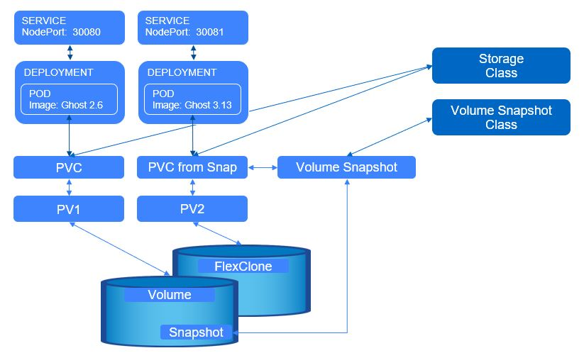

# SCENARIO 14: Test Kubernetes snapshots

**GOAL:**  
Kubernetes 1.17 promoted [CSI Snapshots to Beta](https://kubernetes.io/blog/2019/12/09/kubernetes-1-17-feature-cis-volume-snapshot-beta/).  
This is fully supported by Trident 20.01.1.  



## A. Prepare the environment

We will create an app in its own namespace (also very useful to clean up everything).  
We consider that the ONTAP-NAS backend & storage class have already been created. (cf [Scenario04](../Scenario04)).  
If you compare the Ghost app definition to the [Scenario05](../Scenario05), you may notice that the _deployment_ has evolved from _v1beta1_ to _v1_ status with Kubernetes 1.17.  

```
# kubectl create namespace ghost
namespace/ghost created

# kubectl create -n ghost -f ghost.yaml
persistentvolumeclaim/blog-content created
deployment.apps/blog created
service/blog created

# kubectl get all -n ghost
NAME                       READY   STATUS              RESTARTS   AGE
pod/blog-57d7d4886-5bsml   1/1     Running             0          50s

NAME           TYPE       CLUSTER-IP     EXTERNAL-IP   PORT(S)        AGE
service/blog   NodePort   10.97.56.215   <none>        80:30080/TCP   50s

NAME                   READY   UP-TO-DATE   AVAILABLE   AGE
deployment.apps/blog   1/1     1            1           50s

NAME                             DESIRED   CURRENT   READY   AGE
replicaset.apps/blog-57d7d4886   1         1         1       50s

# kubectl get pvc,pv -n ghost
NAME                                 STATUS   VOLUME                                     CAPACITY   ACCESS MODES   STORAGECLASS        AGE
persistentvolumeclaim/blog-content   Bound    pvc-ce8d812b-d976-43f9-8320-48a49792c972   5Gi        RWX            sc-file-rwx         4m3s

NAME                                                        CAPACITY   ACCESS MODES   RECLAIM POLICY   STATUS   CLAIM                       STORAGECLASS        REASON   AGE
persistentvolume/pvc-ce8d812b-d976-43f9-8320-48a49792c972   5Gi        RWX            Delete           Bound    ghost/blog-content          sc-file-rwx                  4m2s
```
Because moving on, let's check we can access the app:  
=> http://192.168.0.63:30080


## B. Configure the snapshot feature

This [link](https://github.com/kubernetes-csi/external-snapshotter) is a good read if you want to know more details about installing the CSI Snapshotter.  
You first need to install 3 CRD which you can find in the Kubernetes/CRD directory or in the CSI Snapshotter github repository.
```
# kubectl create -f Kubernetes/CRD/
customresourcedefinition.apiextensions.k8s.io/volumesnapshotclasses.snapshot.storage.k8s.io created
customresourcedefinition.apiextensions.k8s.io/volumesnapshotcontents.snapshot.storage.k8s.io created
customresourcedefinition.apiextensions.k8s.io/volumesnapshots.snapshot.storage.k8s.io created
```
Then comes the Snapshot Controller, which is in the Kubernetes/Controller directory  or in the CSI Snapshotter github repository.
```
# kubectl create -f Kubernetes/Controller/
serviceaccount/snapshot-controller created
clusterrole.rbac.authorization.k8s.io/snapshot-controller-runner created
clusterrolebinding.rbac.authorization.k8s.io/snapshot-controller-role created
role.rbac.authorization.k8s.io/snapshot-controller-leaderelection created
rolebinding.rbac.authorization.k8s.io/snapshot-controller-leaderelection created
statefulset.apps/snapshot-controller created
```
Finally, you need to create a _VolumeSnapshotClass_ object that points to the Trident driver.
```
# kubectl create -f sc-volumesnapshot.yaml
volumesnapshotclass.snapshot.storage.k8s.io/csi-snap-class created

# kubectl get volumesnapshotclass
NAME             DRIVER                  DELETIONPOLICY   AGE
csi-snap-class   csi.trident.netapp.io   Delete           3s
```
The _volume snapshot_ feature is now ready to be tested.  


## C. Create a snapshot

```
# kubectl create -n ghost -f pvc-snapshot.yaml
volumesnapshot.snapshot.storage.k8s.io/blog-snapshot created

# kubectl get volumesnapshot -n ghost
NAME            READYTOUSE   SOURCEPVC      SOURCESNAPSHOTCONTENT   RESTORESIZE   SNAPSHOTCLASS    SNAPSHOTCONTENT                                    CREATIONTIME   AGE
blog-snapshot   true         blog-content                           5Gi           csi-snap-class   snapcontent-21331427-59a4-4b4a-a71f-91ffe2fb39bc   12m            12m

# tridentctl -n trident get volume
+------------------------------------------+---------+-------------------+----------+--------------------------------------+--------+---------+
|                   NAME                   |  SIZE   |   STORAGE CLASS   | PROTOCOL |             BACKEND UUID             | STATE  | MANAGED |
+------------------------------------------+---------+-------------------+----------+--------------------------------------+--------+---------+
| pvc-b2113a4f-7359-4ab2-b771-a86272e3d11d | 5.0 GiB | sc-file-rwx       | file     | bdc8ce93-2268-4820-9fc5-45a8d9dead2a | online | true    |
+------------------------------------------+---------+-------------------+----------+--------------------------------------+--------+---------+

# tridentctl -n trident get snapshot
+-----------------------------------------------+------------------------------------------+
|                     NAME                      |                  VOLUME                  |
+-----------------------------------------------+------------------------------------------+
| snapshot-21331427-59a4-4b4a-a71f-91ffe2fb39bc | pvc-b2113a4f-7359-4ab2-b771-a86272e3d11d |
+-----------------------------------------------+------------------------------------------+
```
Your snapshot has been created !  
But what does it translate to at the storage level?  
With ONTAP, you will end up with a *ONTAP Snapshot*, a _ReadOnly_ object, which is instantaneous & space efficient!  
You can see it by browsing through System Manager or connecting with Putty to the _cluster1_ profile (admin/Netapp1!)
```
cluster1::> vol snaps show -vserver svm1 -volume nas1_pvc_b2113a4f_7359_4ab2_b771_a86272e3d11d
                                                                 ---Blocks---
Vserver  Volume   Snapshot                                  Size Total% Used%
-------- -------- ------------------------------------- -------- ------ -----
svm1     nas1_pvc_b2113a4f_7359_4ab2_b771_a86272e3d11d
                  snapshot-21331427-59a4-4b4a-a71f-91ffe2fb39bc
                                                           180KB     0%   18%
```

## D. Create a clone (ie a _PVC from Snapshot_)

Having a snapshot can be useful to create a new PVC.  
If you take a look a the PVC file in the _Ghost/_clone_ directory, you can notice the reference to the snapshot:
```
  dataSource:
    name: blog-snapshot
    kind: VolumeSnapshot
    apiGroup: snapshot.storage.k8s.io
```
Let's see how that turns out:
```
# kubectl create -n ghost -f Ghost_clone/1_pvc_from_snap.yaml
persistentvolumeclaim/pvc-from-snap created

# kubectl get pvc,pv -n ghost
NAME            STATUS   VOLUME                                     CAPACITY   ACCESS MODES   STORAGECLASS        AGE
blog-content    Bound    pvc-b2113a4f-7359-4ab2-b771-a86272e3d11d   5Gi        RWX            sc-file-rwx         20h
pvc-from-snap   Bound    pvc-4d6e8738-a419-405e-96fc-9cf3a0840b56   5Gi        RWX            sc-file-rwx         6s

NAME                                       CAPACITY   ACCESS MODES   RECLAIM POLICY   STATUS   CLAIM                 STORAGECLASS        REASON   AGE
pvc-4d6e8738-a419-405e-96fc-9cf3a0840b56   5Gi        RWX            Delete           Bound    ghost/pvc-from-snap   sc-file-rwx                  19s
pvc-b2113a4f-7359-4ab2-b771-a86272e3d11d   5Gi        RWX            Delete           Bound    ghost/blog-content    sc-file-rwx                  20h
```
Your clone has been created, but what does it translate to at the storage level?  
With ONTAP, you will end up with a *FlexClone*, which is instantaneous & space efficient!  
Said differently,  you can imagine it as a _ReadWrite_ snapshot...  
You can see this object by browsing through System Manager or connecting with Putty to the _cluster1_ profile (admin/Netapp1!)
```
cluster1::> vol clone show
                      Parent  Parent        Parent
Vserver FlexClone     Vserver Volume        Snapshot             State     Type
------- ------------- ------- ------------- -------------------- --------- ----
svm1    nas1_pvc_4d6e8738_a419_405e_96fc_9cf3a0840b56
                      svm1    nas1_pvc_b2113a4f_7359_4ab2_b771_a86272e3d11d
                                            snapshot-21331427-59a4-4b4a-a71f-91ffe2fb39bc
                                                                 online    RW
```
Now that we have a clone, what can we do with?  
Well, we could maybe fire up a new Ghost environment with a new version while keeping the same content? This would a good way to test a new release, while not copying all the data for this specific environment. In other words, you would save time by doing so.  

The first deployment uses Ghost v2.6. Let's try with Ghost 3.13 ...
```
# kubectl create -n ghost -f Ghost_clone/2_deploy.yaml
deployment.apps/blogclone created

# kubectl create -n ghost -f Ghost_clone/3_service.yaml
service/blogclone created

# kubectl get all -n ghost -l scenario=clone
NAME                TYPE       CLUSTER-IP       EXTERNAL-IP   PORT(S)        AGE
service/blogclone   NodePort   10.105.214.201   <none>        80:30081/TCP   12s

NAME                        READY   UP-TO-DATE   AVAILABLE   AGE
deployment.apps/blogclone   1/1     1            1           2m19s
```
Let's check the result:  
=> <http://192.168.0.63:30081>

You can probably notice some differences between both pages...  

Using this type of mechanism in a CI/CD pipeline can definitely save time (that's for Devs) & storage (that's for Ops)!


## E. Cleanup

```
# kubectl delete ns ghost
namespace "ghost" deleted
```

## F. What's next

You can now move on to:  

- [Task 15](../Task_15): Dynamic export policy management  

---
**Page navigation**  
[Top of Page](#top) | [Home](/README.md)