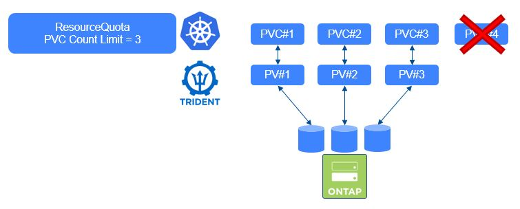
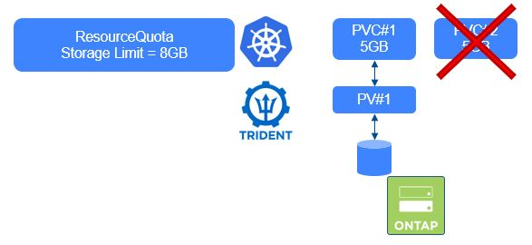
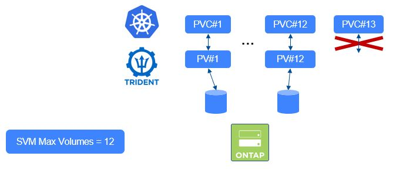

# SCENARIO 9: Consumption control

**GOAL:**  
As Trident dynamically manages persitent volumes & bring lots of goodness to the app level.  
The first benefit is that end-users do not need to rely on a storage admin to provision volumes on the fly.
However, this freedom can lead to quickly feel up the storage backend, especially if the user does not tidy up his environment...  
A good practice is to place some controls to make sure storage is well used.  
We are going to review here different methods to control the storage consumption.

## A. Kubernetes Resource Quotas

In order to restrict the tests to a small environment & not affect other projects, we will create a specific namespace called _quota_  
We will then create two types of quotas:

1. Limit the number of PVC a user can create
2. Limit the total capacity a user can create  

We consider that the ONTAP-NAS backend & storage class have already been created. ([Task 4](../Task_4))

```
# kubectl create namespace quota
namespace/quota created
# kubectl create -n quota -f rq-pvc-count-limit.yaml
resourcequota/pvc-count-limit created
# kubectl create -n quota -f rq-sc-resource-limit.yaml
resourcequota/sc-resource-limit created

# kubectl get resourcequota -n quota
NAME                CREATED AT
pvc-count-limit     2020-04-01T08:48:38Z
sc-resource-limit   2020-04-01T08:48:44Z

# kubectl describe quota pvc-count-limit -n quota
Name:                                                                 pvc-count-limit
Namespace:                                                            quota
Resource                                                              Used  Hard
--------                                                              ----  ----
persistentvolumeclaims                                                0     5
sc-file-rwx.storageclass.storage.k8s.io/persistentvolumeclaims        0     3
```
Now let's start creating some PVC against the storage class _quota_ & check the resource quota usage


```
# kubectl create -n quota -f pvc-quotasc-1.yaml
persistentvolumeclaim/quotasc-1 created
# kubectl create -n quota -f pvc-quotasc-2.yaml
persistentvolumeclaim/quotasc-2 created

# kubectl describe quota pvc-count-limit -n quota
Name:                                                                 pvc-count-limit
Namespace:                                                            quota
Resource                                                              Used  Hard
--------                                                              ----  ----
persistentvolumeclaims                                                2     5
sc-file-rwx.storageclass.storage.k8s.io/persistentvolumeclaims        2     3

# kubectl create -n quota -f pvc-quotasc-3.yaml
persistentvolumeclaim/quotasc-3 created

# kubectl describe quota pvc-count-limit -n quota
Name:                                                                 pvc-count-limit
Namespace:                                                            quota
Resource                                                              Used  Hard
--------                                                              ----  ----
persistentvolumeclaims                                                3     5
sc-file-rwx.storageclass.storage.k8s.io/persistentvolumeclaims        3     3
```
Logically, you got the maximum number of PVC allowed for this storage class. Let's see what happens next...
```
# kubectl create -n quota -f pvc-quotasc-4.yaml
Error from server (Forbidden): error when creating "quotasc-4.yaml": persistentvolumeclaims "quotasc-4" is forbidden: exceeded quota: pvc-count-limit, requested: sc-file-rwx.storageclass.storage.k8s.io/persistentvolumeclaims=1, used: sc-file-rwx.storageclass.storage.k8s.io/persistentvolumeclaims=3, limited: sc-file-rwx.storageclass.storage.k8s.io/persistentvolumeclaims=3
```
As expected, you cannot create a new PVC in this storage class...
Let's clean up the PVC
```
# kubectl delete pvc -n quota --all
persistentvolumeclaim "quotasc-1" deleted
persistentvolumeclaim "quotasc-2" deleted
persistentvolumeclaim "quotasc-3" deleted
```

Time to look at the capacity quotas  


```
# kubectl describe quota sc-resource-limit -n quota
Name:                                                           sc-resource-limit
Namespace:                                                      quota
Resource                                                        Used  Hard
--------                                                        ----  ----
requests.storage                                                0     10Gi
sc-file-rwx.storageclass.storage.k8s.io/requests.storage        0     8Gi
```
Each PVC you are going to use is 5GB.
```
# kubectl create -n quota -f pvc-5Gi-1.yaml
persistentvolumeclaim/5gb-1 created

# kubectl describe quota sc-resource-limit -n quota
Name:                                                           sc-resource-limit
Namespace:                                                      quota
Resource                                                        Used  Hard
--------                                                        ----  ----
requests.storage                                                5Gi   10Gi
sc-file-rwx.storageclass.storage.k8s.io/requests.storage        5Gi   8Gi
```
Seeing the size of the second PVC file, the creation should fail in this namespace
```
# kubectl create -n quota -f pvc-5Gi-2.yaml
Error from server (Forbidden): error when creating "pvc-5Gi-2.yaml": persistentvolumeclaims "5gb-2" is forbidden: exceeded quota: sc-resource-limit, requested: sc-file-rwx.storageclass.storage.k8s.io/requests.storage=5Gi, used: sc-file-rwx.storageclass.storage.k8s.io/requests.storage=5Gi, limited: sc-file-rwx.storageclass.storage.k8s.io/requests.storage=8Gi
```

Before starting the second part of this scenarion, let's clean up
```
# kubeclt delete pvc -n quota 5gb-1
persistentvolumeclaim "5gb-1" deleted
# kubectl delete resourcequota -n quota --all
resourcequota "pvc-count-limit" deleted
resourcequota "sc-resource-limit" deleted
```

## B. Trident parameters

One parameter stands out in the Trident configuration when it comes to control sizes: _limitVolumeSize_  
<https://netapp-trident.readthedocs.io/en/stable-v20.01/dag/kubernetes/storage_configuration_trident.html#limit-the-maximum-size-of-volumes-created-by-trident>  
Depending on the driver, this parameter will

1. Control the PVC Size (ex: driver ONTAP-NAS)
2. Control the size of the ONTAP volume hosting PVC (ex: drivers ONTAP-NAS-ECONOMY or ONTAP-SAN-ECONOMY)


Let's create a backend with this parameter setup (limitVolumeSize = 5g), followed by the storage class that points to it, using the storagePools parameter:
```
# tridentctl -n trident create backend -f backend-nas-limitsize.json
+------------------+----------------+--------------------------------------+--------+---------+
|       NAME       | STORAGE DRIVER |                 UUID                 | STATE  | VOLUMES |
+------------------+----------------+--------------------------------------+--------+---------+
| NAS_LimitVolSize | ontap-nas      | 8b94769a-a759-4840-b936-985a360f2d87 | online |       0 |
+------------------+----------------+--------------------------------------+--------+---------+

# kubectl create -f sc-backend-limit.yaml
storageclass.storage.k8s.io/sclimitvolumesize created
```
Let's see the behavior of the PVC creation, using the pvc-10Gi.yaml file.
```
# kubectl create -f pvc-10Gi.yaml
persistentvolumeclaim/10g created

# kubectl get pvc
NAME   STATUS    VOLUME                                     CAPACITY   ACCESS MODES   STORAGECLASS        AGE
10g    Pending                                                                        sclimitvolumesize   10s
```
The PVC will remain in the _Pending_ state. You need to look either in the PVC logs or Trident's
```
# kubectl describe pvc 10g
Name:          10g
Namespace:     default
StorageClass:  sclimitvolumesize
Status:        Pending
Volume:
Labels:        <none>
Annotations:   volume.beta.kubernetes.io/storage-provisioner: csi.trident.netapp.io
Finalizers:    [kubernetes.io/pvc-protection]
Capacity:
Access Modes:
VolumeMode:    Filesystem
Mounted By:    <none>
Events:
  Type     Reason                Age                    From                                                                                     Message
  ----     ------                ----                   ----                                                                                     -------
  Normal   Provisioning          2m32s (x9 over 6m47s)  csi.trident.netapp.io_trident-csi-6b778f79bb-scrzs_7d29b71e-2259-4287-9395-c0957eb6bd88  External provisioner is provisioning volume for claim "default/10g"
  Normal   ProvisioningFailed    2m32s (x9 over 6m47s)  csi.trident.netapp.io                                                                    encountered error(s) in creating the volume: [Failed to create volume pvc-19b8363f-23d6-43d1-b66f-e4539c474063 on storage pool aggr1 from backend NAS_LimitVolSize: requested size: 10737418240 > the size limit: 5368709120]
  Warning  ProvisioningFailed    2m32s (x9 over 6m47s)  csi.trident.netapp.io_trident-csi-6b778f79bb-scrzs_7d29b71e-2259-4287-9395-c0957eb6bd88  failed to provision volume with StorageClass "sclimitvolumesize": rpc error: code = Unknown desc = encountered error(s) in creating the volume: [Failed to create volume pvc-19b8363f-23d6-43d1-b66f-e4539c474063 on storage pool aggr1 from backend NAS_LimitVolSize: requested size: 10737418240 > the size limit: 5368709120]
  Normal   ExternalProvisioning  41s (x26 over 6m47s)   persistentvolume-controller                                                              waiting for a volume to be created, either by external provisioner "csi.trident.netapp.io" or manually created by system administrator
```
The error is now identified... 
You can decide to review the size of the PVC, or you can next ask the admin to update the Backend definition in order to go on.

Let's clean up before moving to the last chapter of this scenario.
```
# kubectl delete pvc 10g
persistentvolumeclaim "10g" deleted
# kubectl delete sc sclimitvolumesize
storageclass.storage.k8s.io "sclimitvolumesize" deleted
# tridentctl -n trident delete backend NAS_LimitVolSize
```

## C. ONTAP parameters

The amount of ONTAP volumes (Flexvols) you can have on a ONTAP cluster depends on several parameters:

- Version
- Size of the ONTAP cluster (in terms of controllers)  

If the storage platform is also used by other workloads (Databases, Files Services ...), you may want to limit the number of PVC you build in your storage Tenant (ie SVM)
This can be achieved by setting a parameter on this SVM.  
<https://netapp-trident.readthedocs.io/en/stable-v20.01/dag/kubernetes/storage_configuration_trident.html#limit-the-maximum-volume-count>



Before setting a limit in the SVM _svm1_, you first need to look for the current number of volumes you have.
You can either login to System Manager & count, or run the following (password Netapp1!)
```
# ssh -l admin 192.168.0.101 vol show -vserver svm1 | grep svm1 | wc -l
```
In my case, in have 10 volumes, I will then set the maximum to 12 for this exercise.
```
# ssh -l admin 192.168.0.101 vserver modify -vserver svm1 -max-volumes 12
```
We will then try to create a few new PVC.
```
# kubectl create -f pvc-quotasc-1.yaml
persistentvolumeclaim/quotasc-1 created
# kubectl create -f pvc-quotasc-2.yaml
persistentvolumeclaim/quotasc-2 created
# kubectl create -f pvc-quotasc-3.yaml
persistentvolumeclaim/quotasc-3 created

# kubectl get pvc  -l scenario=quotas
NAME        STATUS   VOLUME                                     CAPACITY   ACCESS MODES   STORAGECLASS        AGE
quotasc-1   Bound     pvc-a74622aa-bb26-4796-a624-bf6d72955de8   1Gi        RWX            sc-file-rwx        92s
quotasc-2   Bound     pvc-f2bd901a-35e8-45a1-8294-2135b56abe19   1Gi        RWX            sc-file-rwx        22s
quotasc-3   Pending                                                                        sc-file-rwx        4s
```
The PVC will remain in the _Pending_ state. You need to look either in the PVC logs or Trident's
```
#kubectl describe pvc quotasc-3
...
 Warning  ProvisioningFailed    15s                
 API status: failed, Reason: Cannot create volume. Reason: Maximum volume count for Vserver svm1 reached.  Maximum volume count is 12. , Code: 13001
...
```
There you go, point demonstrated!

Time to clean up
```
# kubectl delete pvc -l scenario=quotas
persistentvolumeclaim "quotasc-1" deleted
persistentvolumeclaim "quotasc-2" deleted
persistentvolumeclaim "quotasc-3" deleted
```

## D. What's next

You can now move on to:  

- [Task 10](../Task_10): Resize a NFS CSI PVC
- [Task 11](../Task_11): Using Virtual Storage Pools  
- [Task 12](../Task_12): StatefulSets & Storage consumption  

[Top of page](https://github.com/carlgranfelt/NetApp-LoD/tree/master/trident_with_k8s/Tasks/Task_9#top) or [Home](https://github.com/carlgranfelt/NetApp-LoD)